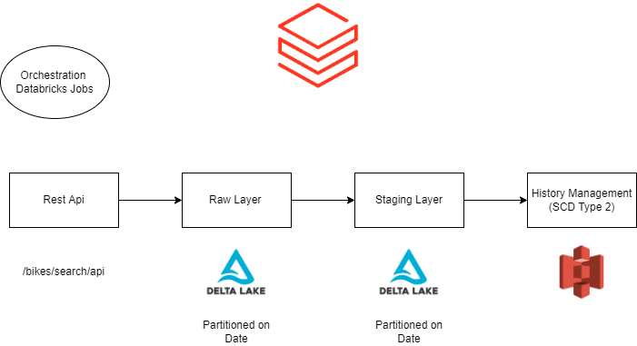

# Daily Refresh Bikes Details

Takes Data from Rest API (https://bikeindex.org/documentation/api_v3) ingest into Object Store on daily basis

### Pipeline Architecture

### Pipeline Flow Steps
* Hit the Bike rest API (Method GET) and store the results into json format.
* Raw Layer - Read JSON file and store result in Delta format partitioned by date.
* Staging Layer - Read the partitioned date output , apply transformation(explode) and store the result in delta  format partitioned by date, this layer can be consumed for text analyses.
* As we have requirement for keeping all versions of incidents , this can be achieved by implementation of SCD(Slowly changing Dimension) Type 2.

### Approach for SCD Type 2
* As we maintain complete history of all records , majorly used three columns
1. Active_Status - Y for Active Records, N for Inactive records
2. End_date - Active(9999-12-31) and Inactive(Date on which it is expired)
3. start_date - Date on which Record Came into System.

Please take a look at Complete SCD Type 2 Flow - https://docs.google.com/spreadsheets/d/1Zk2iotJXvm3VO--g6w13orz7uli-iRsaIsUgN2jcx-A/edit#gid=0 
### Tech Stack
* Databricks
* Pyspark
* SQL
* Delta (Support for UPSERT , MERGE and Schema Evolution)

